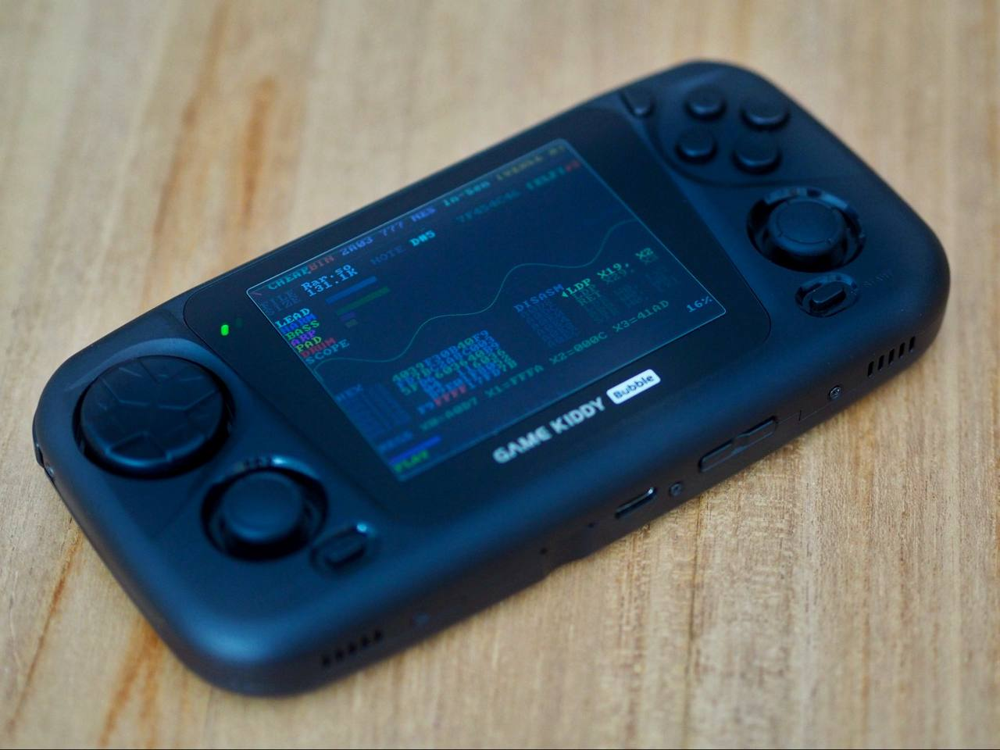

# ♪ CHEAPBIN

> *You, reverser — ever wondered what `/bin/ls` sounded like?*

No? Well, you're about to find out anyway.


**cheapbin** turns any binary file into chiptune music. Feed it an executable, a firmware dump, a JPEG, a kernel module — doesn't matter. It reads the bytes, finds the melody hiding inside, and plays it back through your speakers while a hacker terminal UI scrolls fake disassembly at you.

> **macOS & Linux.** Uses Core Audio on macOS, ALSA on Linux. Won't build on Windows. An SDL2 frontend also ships for handheld Linux devices such as the **GKD Bubble** — gamepad-driven, 640×480, no terminal required.

It ships with **4 hardware sound chip emulations** — each file plays the same song, but filtered through the character of classic chip hardware:

| Key | Chip | System | Sound |
|-----|------|--------|-------|
| SID | MOS 6581 | Commodore 64 | Warm PWM sweeps, resonant filter, analog saturation |
| 2A03 | Ricoh 2A03 | Nintendo NES | 4-bit triangle, pulse duty snapping, crunchy & dry |
| YM2612 | Yamaha YM2612 | Sega Genesis | FM waveshaping, DAC grit, hardware tremolo |
| AY-3-8910 | General Instrument | ZX Spectrum 128K | Pure square waves, thin & buzzy beeper feel |

A chip is auto-selected for a given file (i.e. `/bin/ls` will always use the same chip), or you can force one with `--chip` and cycle through them live with `c`.

It also ships a **music style translation layer** — 10 genre transforms that morph the feel of the music while keeping each file's unique musical DNA intact. The melodies, rhythms, and structure stay recognizable; only the style changes:

| Style | Vibe |
|-------|------|
| Synthwave | Driving 80s retro-futuristic: pulsating sawtooth bass, lush PWM leads, rigid 4-on-the-floor |
| Dungeon Synth | Slow, dark, atmospheric: haunting pads, sparse triangle melodies, minimal percussion |
| Baroque | Bach counterpoint: harpsichord-thin pulses, canon/fugue echo, walking bass, strict time |
| Acid House | Squelchy 303-style bass with heavy portamento, 4-on-the-floor kick, offbeat hats |
| Doom Metal | Slow, heavy, oppressive: down-tuned sawtooth bass, aggressive lead, droning pads |
| Eurobeat | Extremely fast sweeping arpeggios, off-beat driving bass, relentless 16th hi-hats |
| Demoscene | Rapid-fire square arpeggios, punchy staccato bass, crisp syncopated drums, chip precision |
| Ska/Reggae | Off-beat "skank" chords, walking melodic bass, one-drop drum pattern, bouncy swing |
| Trap/Lo-Fi | Booming 808 sub-bass with glide, rapid hi-hat rolls, mellow sparse lead, heavy swing |
| Prog Rock | Odd-time displaced accents, clean triangle lead, angular bass, irregular drum patterns |

By default no style is applied. Force one with `--style` or cycle through them live with `s`.

`/bin/ls` and `/bin/cat` sound different. Your malware sample and a JPEG sound different. Every binary has a unique musical fingerprint. This program finds it.

---

## Build

```bash
cmake -B build && cmake --build build
```

Needs macOS or Linux, CMake, and a C11 compiler. That's it. No dependencies.

---

## SDL / Handheld Build

An SDL2 frontend ships alongside the terminal build, targeting 640×480 handheld devices. It reproduces the full cheapbin experience — all chips, styles, scales, and r2 integration — in a graphical window controlled by gamepad or keyboard. Audio goes through ALSA on Linux targets or the SDL2 audio subsystem on macOS.



Build with `Makefile.sdl` instead of CMake. Requires SDL2 and (on Linux) ALSA:

```bash
# Native macOS or Linux
make -f Makefile.sdl

# Cross-compile for ARM64 Linux (GKD Bubble and similar handhelds)
make -f Makefile.sdl linux-arm64
# Output: cheapbin-sdl-aarch64

# Browser/WebAssembly build via Emscripten
make -f Makefile.sdl web
# Output: build/web/cheapbin.html
```

The web target uses Emscripten's SDL2 port for both video and audio. It
preloads `WEB_FILE` into the browser filesystem at `WEB_MOUNT` and starts the
SDL frontend with `WEB_ARGS`, which defaults to the mounted file path. To use a
different bundled input or startup mode, override those knobs:

```bash
make -f Makefile.sdl web \
	WEB_FILE=firmware.bin \
	WEB_MOUNT=/firmware.bin \
	WEB_ARGS="--style synthwave /firmware.bin"
```

Serve the generated files from `build/web` with any local HTTP server, for
example `python3 -m http.server --directory build/web 8000`, then open
`http://localhost:8000/cheapbin.html`. Browser builds always use the built-in
fallback disassembly/register visualizer because they cannot spawn a local
radare2 process. Some browsers also require a click or key press before audio
playback is allowed.

### Cross-compile overrides

If the default `pkg-config` doesn't resolve SDL2/ALSA paths or the compiler is named differently, override `ARM64_CC`, `arm64_CFLAGS`, and `arm64_LIBS` on the command line. See [GKD.md](GKD.md) for a detailed cross-compile walkthrough, including sysroot setup and the rationale behind linker flags like `--allow-shlib-undefined`.

### Gamepad controls

| Button | Action |
|--------|--------|
| A / Start | pause / resume |
| D-pad ← / → | seek −5 s / +5 s |
| D-pad ↑ / ↓ | cycle scale (prev / next) |
| X | cycle chip (next) |
| Y | cycle style (next) |
| L / R | cycle chip prev / style prev |
| B / Back | quit |

The SDL build accepts both `SDL_GameController`-mapped devices and raw joysticks. Keyboard controls mirror the terminal build; the SDL build has a single unified display — no `t` / theme cycling.

### GKD Bubble installation

```bash
mount -o remount,rw /
cp cheapbin-sdl-aarch64 /usr/bin/cheapbin
cp src/sdl/cheapbin.gxmenu /storage/miniplus/sections/01arcade/08cheapbin
cp assets/cheapbin-icon.png /storage/miniplus/skins/Default/icons/cheapbin.png
```

---

## Use

```bash
./build/cheapbin <any file>
./build/cheapbin --chip sid <any file>
./build/cheapbin --chip genesis <any file>
./build/cheapbin --style synthwave <any file>
./build/cheapbin --style doom --chip sid <any file>
./build/cheapbin --no-r2 <any file>     # skip radare2; use built-in fake disasm
```

```bash
./build/cheapbin /bin/ls
./build/cheapbin --chip nes /bin/bash
./build/cheapbin --chip spectrum firmware.bin
./build/cheapbin --style baroque /usr/lib/libc.dylib
./build/cheapbin --style trap some_malware_sample.bin
./build/cheapbin ~/Downloads/suspicious.pdf
```

`space` to pause. `h`/`←` seek back 5 s. `l`/`→` seek forward 5 s. `c` to cycle sound chips. `s` to cycle music styles. `k` to cycle musical scales. `t` to cycle themes. `q` to quit.

---

## Themes

Three built-in UI themes, cycled with `t`:

| Theme | Look |
|-------|------|
| **Default** | The original cheapbin hacker terminal — green-on-black with hex, meters, and RE quotes |
| **SoftICE** | NuMega SoftICE kernel debugger — black background, cyan register values, green section headers, PROT32 status bar, CPU flags, segment:offset addresses, CONSOLE event log |
| **TD32** | Borland Turbo Debugger 32 — teal BIOS VGA background, double-line bordered panels, dark blue selection bar, red menu hotkeys, READY indicator, function key bar |

All themes are **architecture-aware** when radare2 is active — register names, CPU panel title, and stack pointer adapt automatically to x86-32, x86-64, ARM32, or AArch64. Each theme includes its own oscilloscope waveform style with half-block sub-character rendering.

---

## radare2 integration

When `radare2` is installed and the input file is a recognised executable (ELF, Mach-O, PE, DEX…), cheapbin spawns an r2 subprocess via r2pipe and uses it as a live analysis backend:

| Feature | With r2 | Without r2 |
|---------|---------|------------|
| Disassembly panel | Real disassembly for the detected arch/bits | Rotating fake disassembly strings |
| Register panel | Arch-appropriate live register names and ESIL-stepped values (x86-64 `rax`…`rip`, ARM64 `x0`…`pc`, etc.) | Pseudo-random values driven by file bytes |
| Hex / byte reads | Actual bytes read from the mapped binary at the current PC | File bytes wrapped modulo file size |
| PC tracking | Walks the real `.text` section via `aes` ESIL emulation, anchored to `entry0` | Counter that ticks up by a few bytes each frame |

r2 is **enabled by default** and **silently disabled** if:
- `radare2` is not in `$PATH`,
- the file has no recognised entry point (`entry0` returns 0),
- or the r2 subprocess crashes or closes its pipe.

Force the fallback with `-r` / `--no-r2`:

```bash
./build/cheapbin --no-r2 /bin/ls           # fake disasm even for executables
./build/cheapbin firmware.bin              # non-executable — fallback used automatically
```

---

## What you'll see

A terminal UI that looks like a CTF challenge and a NES had a baby:

- **6-channel level meters** — lead, harmony, bass, arpeggio, pad, drums, all color-coded and animated
- **Sound chip indicator** — shows the active chip and iconic device name in the header (e.g. `SID │ C64`)
- **Live oscilloscope** — waveform visualization with hex addresses in the gutter
- **Hex dump** — your actual file bytes scrolling in real time as the song plays through them
- **Fake disassembly ticker** — because ambiance
- **1000+ rotating RE quotes** — wisdom from the trenches, one every 3 seconds
- **Fake register panel** — values that actually correlate with the music
- **Magic byte detection** — identifies your file format from the header

---

## How the sausage is made

The binary gets divided into 256-byte chunks. Each chunk's entropy, byte distribution, and bit patterns become musical parameters — tempo, key, scale, chord progression, drum rhythm, waveform shape. High-entropy sections (compressed/encrypted data) play faster and more chaotic. Null-heavy sections breathe. The melody is always pentatonic minor so it never sounds like garbage, no matter what file you throw at it.

Six synthesis channels: lead (square/saw/tri), harmony, bass (triangle), arpeggio (25% pulse), pad, and a noise drum channel with kick/snare/hat patterns derived from the file's bit patterns. ADSR envelopes, PWM, vibrato, portamento, delay/echo, soft clipping. All running at 44100 Hz through Core Audio.

Each chip emulation applies a 3-stage DSP pipeline to every sample:

1. **Voice adjustment** — waveform and duty cycle overrides (e.g. NES snaps to hardware pulse duties, Spectrum forces 50% square)
2. **Channel coloring** — per-channel post-processing (NES 4-bit triangle stepping, Genesis tanh waveshaping, SID ring modulation)
3. **Global post-processing** — output-stage filtering (SID resonant sweep filter, NES two-stage HP chain, Genesis DAC quantization, Spectrum DC-blocking HP + 5-bit DAC)

Chip-specific delay/reverb, low-pass filtering, and per-channel volume mixes ensure each chip sounds distinctly different even on the same song.

The whole point is that *different files sound genuinely different*, and that it sounds good doing it.

---

## Sounds good on

- Kernel extensions (`.kext`)
- Firmware blobs
- Fat Mach-O binaries
- Stripped binaries (especially stripped binaries)
- Malware samples *(not that you have any)*
- Anything with high entropy in weird places

---

## License

Public domain. Do whatever you want with it.

---

*"Every binary has a melody waiting to be heard."*
