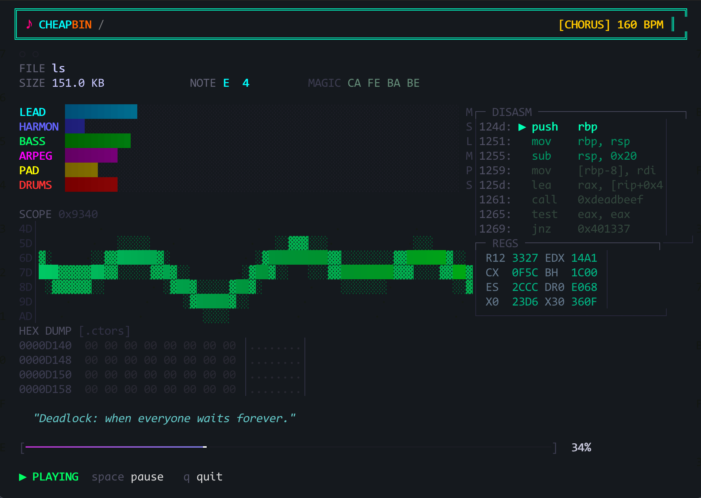

# ♪ CHEAPBIN

> *You, reverser — ever wondered what `/bin/ls` sounded like?*

> **macOS only.** Uses Core Audio. Won't build on Linux or Windows. Sorry.

No? Well, you're about to find out anyway.



**cheapbin** turns any binary file into chiptune music. Feed it an executable, a firmware dump, a JPEG, a kernel module — doesn't matter. It reads the bytes, finds the melody hiding inside, and plays it back as 8-bit NES-style chiptune through your speakers while a hacker terminal UI scrolls fake disassembly at you.

`/bin/ls` and `/bin/cat` sound different. Your malware sample and a JPEG sound different. Every binary has a unique musical fingerprint. This program finds it.

---

## Install

```bash
cmake -B build && cmake --build build
```

Needs macOS (uses Core Audio) and a C11 compiler. That's it. No dependencies.

---

## Use

```bash
./build/cheapbin <any file>
```

```bash
./build/cheapbin /bin/ls
./build/cheapbin /bin/bash
./build/cheapbin /usr/lib/libc.dylib
./build/cheapbin some_malware_sample.bin
./build/cheapbin firmware.bin
./build/cheapbin ~/Downloads/suspicious.pdf
```

`space` to pause. `q` to quit.

---

## What you'll see

A terminal UI that looks like a CTF challenge and a NES had a baby:

- **6-channel level meters** — lead, harmony, bass, arpeggio, pad, drums, all color-coded and animated
- **Live oscilloscope** — waveform visualization with hex addresses in the gutter
- **Hex dump** — your actual file bytes scrolling in real time as the song plays through them
- **Fake disassembly ticker** — because ambiance
- **1000+ rotating RE quotes** — wisdom from the trenches, one every 3 seconds
- **Fake register panel** — values that actually correlate with the music
- **Magic byte detection** — identifies your file format from the header

---

## How the sausage is made

The binary gets divided into 256-byte chunks. Each chunk's entropy, byte distribution, and bit patterns become musical parameters — tempo, key, scale, chord progression, drum rhythm, waveform shape. High-entropy sections (compressed/encrypted data) play faster and more chaotic. Null-heavy sections breathe. The melody is always pentatonic minor so it never sounds like garbage, no matter what file you throw at it.

Six synthesis channels: lead (square/saw/tri), harmony, bass (triangle), arpeggio (25% pulse), pad, and a noise drum channel with kick/snare/hat patterns derived from the file's bit patterns. ADSR envelopes, PWM, vibrato, portamento, delay/echo, soft clipping. All running at 44100 Hz through Core Audio.

The whole point is that *different files sound genuinely different*, and that it sounds good doing it.

---

## Sounds good on

- Kernel extensions (`.kext`)
- Firmware blobs
- Fat Mach-O binaries
- Stripped binaries (especially stripped binaries)
- Malware samples *(not that you have any)*
- Anything with high entropy in weird places

---

## License

Public domain. Do whatever you want with it.

---

*"Every binary has a melody waiting to be heard."*
